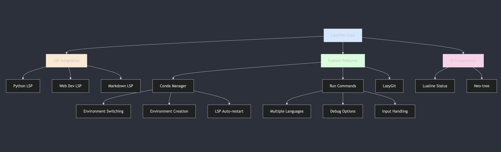

# Development Environment Setup

My personal development environment configuration, optimized for Python on macOS/linux. This setup includes configurations for Neovim, Tmux, and Kitty terminal.

### Architecture



## Features

### Neovim Configuration

- LazyVim-based setup with custom configurations
- Full LSP support for Python, Javascript, Markdown and web development
- Integrated Conda environment management
- Git integration with LazyGit
- Enhanced terminal integration
- File explorer with neo-tree
- Custom statusline with environment indicators

### Tmux Configuration

- Custom key bindings
- Session management
- Status bar customization
- Seamless navigation

### Kitty Terminal

- Performance-focused terminal emulator
- Custom color scheme
- Optimized font settings

## Prerequisites

```bash
# Install Homebrew if not already installed
/bin/bash -c "$(curl -fsSL https://raw.githubusercontent.com/Homebrew/install/HEAD/install.sh)"

# Install required packages
brew install neovim
brew install tmux
brew install kitty
brew install ripgrep
brew install fd
brew install git
```

## Installation

1. **Clone the repository:**

```bash
git clone https://github.com/ansh-info/dotfiles.git
```

2. **Create necessary directories:**

```bash
mkdir -p ~/.config
```

3. **Install Neovim configuration:**

```bash
# Backup existing config if necessary
[ -d ~/.config/nvim ] && mv ~/.config/nvim ~/.config/nvim.bak

# Copy Neovim configuration
cp -r dev-config/nvim ~/.config/
```

4. **Install Tmux configuration:**

```bash
# Backup existing config if necessary
[ -f ~/.tmux.conf ] && mv ~/.tmux.conf ~/.tmux.conf.bak

# Copy Tmux configuration
cp dev-config/tmux.conf ~/.tmux.conf
```

5. **Install Kitty configuration:**

```bash
# Backup existing config if necessary
[ -d ~/.config/kitty ] && mv ~/.config/kitty ~/.config/kitty.bak

# Copy Kitty configuration
cp -r dev-config/kitty ~/.config/
```

## Post-Installation

### Neovim Setup

1. Open Neovim to install plugins:

```bash
nvim
```

The plugins will be automatically installed on first launch.

2. Install LSP servers and tools:

```
:Mason
```

### Python Development Setup

1. Install Conda if not already installed:

```bash
brew install --cask anaconda
```

2. Initialize Conda in your shell:

```bash
conda init "$(basename "$SHELL")"
```

## Key Bindings

### Neovim

- `<leader>` is set to space
- `<leader>c8`: Open Conda environment selector
- `<leader>c9`: Create new Conda environment
- `<leader>gg`: Open LazyGit
- `<leader>e`: Toggle file explorer
- `<leader>ff`: Find files
- `<leader>fg`: Live grep
- Check `:help lazyvim-keymaps` for more

### Tmux

- Prefix is set to `Ctrl-a`
- `Prefix + |`: Split vertically
- `Prefix + -`: Split horizontally
- `Prefix + h/j/k/l`: Navigate panes
- `Prefix + c`: Create new window
- `Prefix + n/p`: Next/previous window

### Kitty

- `Ctrl+Shift+Enter`: New window
- `Ctrl+Shift+w`: Close window
- `Ctrl+Shift+]`: Next window
- `Ctrl+Shift+[`: Previous window

## Customization

### Adding Custom Neovim Plugins

Add new plugins in `~/.config/nvim/lua/plugins/`:

```lua
return {
  {
    "plugin/name",
    config = function()
      -- configuration here
    end,
  },
}
```

### Modifying Tmux Configuration

Edit `~/.tmux.conf` for Tmux customizations.

### Updating Kitty Settings

Edit `~/.config/kitty/kitty.conf` for Kitty customizations.

## Updating

### Neovim Plugins

```vim
:Lazy update
```

### Mason Packages

```vim
:MasonUpdate
```

## Troubleshooting

### Neovim

- Run `:checkhealth` to diagnose issues
- Ensure all required dependencies are installed
- Check `:Mason` for LSP server status

### Tmux

- Check tmux version: `tmux -V`
- Verify configuration: `tmux show -g`

### Kitty

- Run `kitty --debug-config` to verify configuration
- Check terminal capabilities: `kitty +kitten icat --detect-support`

## Contributing

Feel free to submit issues and enhancement requests!

## License

This project is licensed under the MIT License - see the LICENSE file for details.
