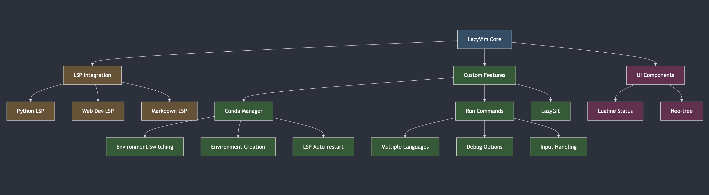

# Development Environment Setup

My personal development environment configuration, optimized for Python on macOS/linux. This setup includes configurations for Neovim, Tmux, and Kitty terminal.

### Architecture



### Prerequisites - [Homebrew](https://brew.sh)

```bash
# Install Homebrew if not already installed
/bin/bash -c "$(curl -fsSL https://raw.githubusercontent.com/Homebrew/install/HEAD/install.sh)"

# Post-Installation and Homebrew to your path - ~/.zshrc or ~/.bashrc

# Install required packages
brew install neovim
brew install tmux
brew install kitty
brew install ripgrep
brew install lazygit
brew install ripgrep
brew install gcc
brew install fd
brew install git
```

### Install [Zsh](https://github.com/ohmyzsh/ohmyzsh/wiki/Installing-ZSH) shell

```bash
# - For macOS/linux

brew install zsh
chsh -s $(which zsh)
```

### Install [ohmyzsh](https://ohmyz.sh)

```bash
sh -c "$(curl -fsSL https://raw.githubusercontent.com/ohmyzsh/ohmyzsh/master/tools/install.sh)"
```

### Install [powerlvl10k](https://github.com/romkatv/powerlevel10k) using [ohmyzsh](https://ohmyz.sh)

```bash
git clone --depth=1 https://github.com/romkatv/powerlevel10k.git ${ZSH_CUSTOM:-$HOME/.oh-my-zsh/custom}/themes/powerlevel10k
```

#### Install [Zsh Syntax-highlighting](https://github.com/zsh-users/zsh-syntax-highlighting)

```bash
git clone https://github.com/zsh-users/zsh-syntax-highlighting.git ${ZSH_CUSTOM:-~/.oh-my-zsh/custom}/plugins/zsh-syntax-highlighting
```

#### Install [Zsh Auto-suggestion](https://github.com/zsh-users/zsh-autosuggestions)

```bash
git clone https://github.com/zsh-users/zsh-autosuggestions ${ZSH_CUSTOM:-~/.oh-my-zsh/custom}/plugins/zsh-autosuggestions
```

#### Install [Colorls](https://github.com/athityakumar/colorls) with [Ruby](https://www.ruby-lang.org/en/documentation/installation/)

```bash
brew install ruby
gem install colorls
source $(dirname $(gem which colorls))/tab_complete.sh
```

#### Install [Nerd Fonts](https://github.com/ryanoasis/nerd-fonts)

```bash
brew install font-hack-nerd-font
```

## Installation

1. **Clone the repository:**

```bash
git clone https://github.com/ansh-info/dotfiles.git
```

#### zshrc configuration

```bash
# Backup existing config if necessary
cp -r dotfiles/.zshrc ~/
cp -r dotfiles/.p10k.zsh ~/
```

#### Finally source the zshrc

```bash
source ~/.zshrc
```

2. **Create necessary directories:**

```bash
mkdir -p ~/.config
```

3. **Install Neovim configuration:**

```bash
# Backup existing config if necessary
[ -d ~/.config/nvim ] && mv ~/.config/nvim ~/.config/nvim.bak
```

```bash
# Copy Neovim configuration
cp -r dotfiles/nvim ~/.config/
```

4. **Install Tmux configuration:**

```bash
# Backup existing config if necessary
[ -f ~/.tmux.conf ] && mv ~/.tmux.conf ~/.tmux.conf.bak

# Copy Tmux configuration
cp dotfiles/tmux.conf ~/.tmux.conf
```

#### Install [Tmux plugin manager](https://github.com/tmux-plugins/tpm)

```bash
git clone https://github.com/tmux-plugins/tpm ~/.tmux/plugins/tpm

Reload TMUX environment so TPM is sourced:

# type this in terminal if tmux is already running
tmux source ~/.tmux.conf
```

That's it!

#### Installing plugins

1. Add new plugin to `~/.tmux.conf` with `set -g @plugin '...'`
2. Press `prefix` + <kbd>I</kbd> (capital i, as in **I**nstall) to fetch the plugin.

You're good to go! The plugin was cloned to `~/.tmux/plugins/` dir and sourced.

5. **Install Kitty configuration:**

```bash
# Backup existing config if necessary
[ -d ~/.config/kitty ] && mv ~/.config/kitty ~/.config/kitty.bak
```

#### Copy Kitty configuration

```bash
cp -r dotfiles/kitty ~/.config/
```

5. **Install LazyGit configuration:**

```bash
# Create lazygit directory
mkdir -p ~/Library/Application\ Support/lazygit
```

```bash
# Copy LazyGit configuration
cp -r dotfiles/config.yml ~/Library/Application Support/lazygit/
```

## Post-Installation

### Neovim Setup

1. Open Neovim to install plugins:

```bash
nvim
```

The plugins will be automatically installed on first launch.

2. Install LSP servers and tools:

```
:Mason
```

### Python Development Setup

1. Install [Conda](https://docs.anaconda.com/miniconda/) if not already installed:

```bash
mkdir -p ~/miniconda3
curl https://repo.anaconda.com/miniconda/Miniconda3-latest-MacOSX-arm64.sh -o ~/miniconda3/miniconda.sh
bash ~/miniconda3/miniconda.sh -b -u -p ~/miniconda3
rm ~/miniconda3/miniconda.sh
```

2. Initialize Conda in your shell:

```bash
source ~/miniconda3/bin/activate
conda init --all
```

## Features

### Neovim Configuration

- LazyVim-based setup with custom configurations
- Full LSP support for Python, Javascript, Markdown and web development
- Integrated Conda environment management
- Git integration with LazyGit
- Enhanced terminal integration
- File explorer with neo-tree
- Custom statusline with environment indicators

### Tmux Configuration

- Custom key bindings
- Session management
- Status bar customization
- Seamless navigation

### Kitty Terminal

- Performance-focused terminal emulator
- Custom color scheme
- Optimized font settings

## Key Bindings

### Neovim

- `<leader>` is set to space
- `<leader>ce`: Open Conda environment selector
- `<leader>gg`: Open LazyGit
- `<leader>e`: Toggle file explorer
- `<leader>ff`: Find files
- `<leader>fg`: Live grep
- Check `:help lazyvim-keymaps` for more

### Tmux

- Prefix is set to `Ctrl-a`
- `Prefix + |`: Split vertically
- `Prefix + -`: Split horizontally
- `Prefix + h/j/k/l`: Navigate panes
- `Prefix + c`: Create new window
- `Prefix + n/p`: Next/previous window

### Kitty

- `Ctrl+Shift+Enter`: New window
- `Ctrl+Shift+w`: Close window
- `Ctrl+Shift+]`: Next window
- `Ctrl+Shift+[`: Previous window

## Customization

### Adding Custom Neovim Plugins

Add new plugins in `~/.config/nvim/lua/plugins/`:

```lua
return {
  {
    "plugin/name",
    config = function()
      -- configuration here
    end,
  },
}
```

### Modifying Tmux Configuration

Edit `~/.tmux.conf` for Tmux customizations.

### Updating Kitty Settings

Edit `~/.config/kitty/kitty.conf` for Kitty customizations.

## Updating

### Neovim Plugins

```vim
:Lazy update
```

### Mason Packages

```vim
:MasonUpdate
```

## Troubleshooting

### Neovim

- Run `:checkhealth` to diagnose issues
- Ensure all required dependencies are installed
- Check `:Mason` for LSP server status

### Tmux

- Check tmux version: `tmux -V`
- Verify configuration: `tmux show -g`

### Kitty

- Run `kitty --debug-config` to verify configuration
- Check terminal capabilities: `kitty +kitten icat --detect-support`

## Contributing

Feel free to submit issues and enhancement requests!

## License

This project is licensed under the MIT License - see the [LICENSE](LICENSE) file for details.
